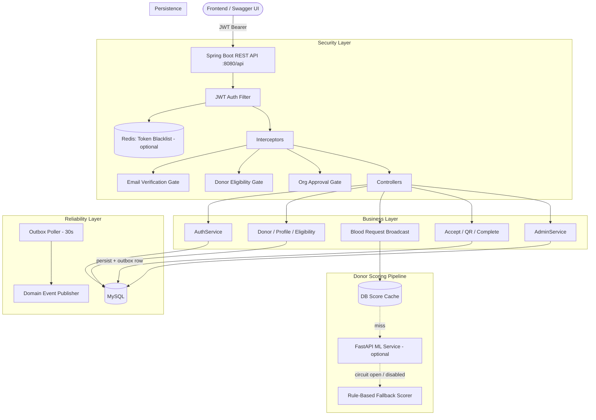
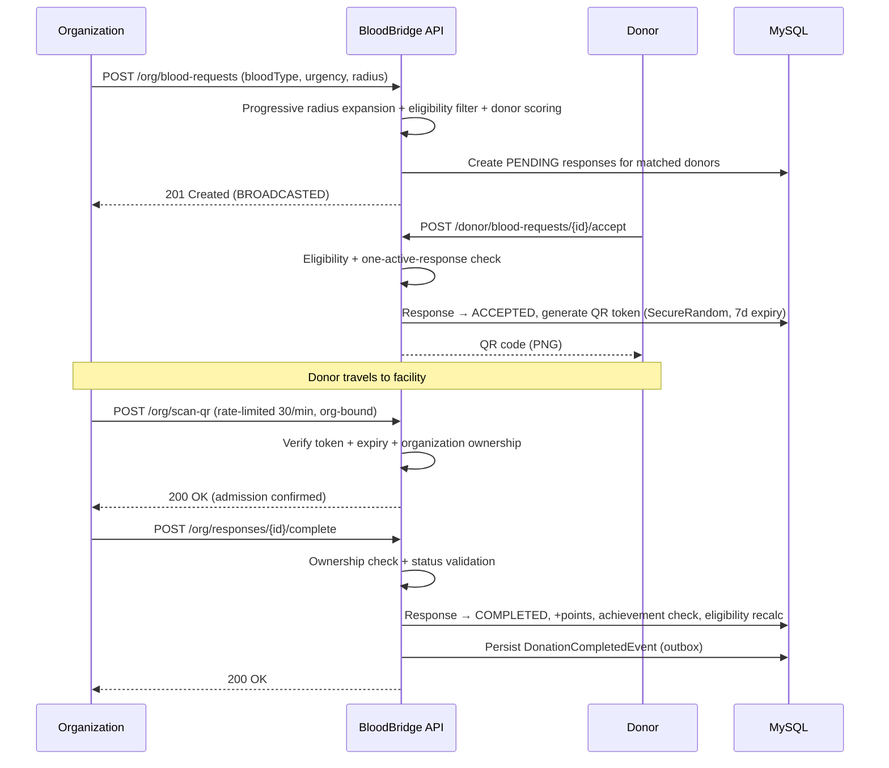
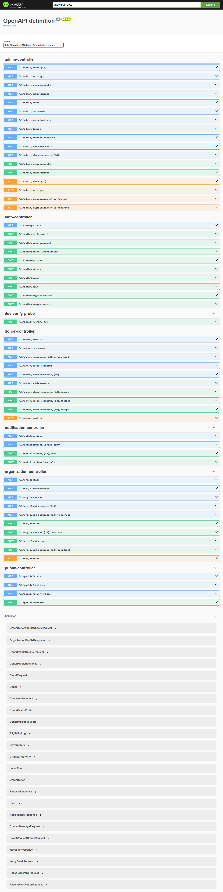
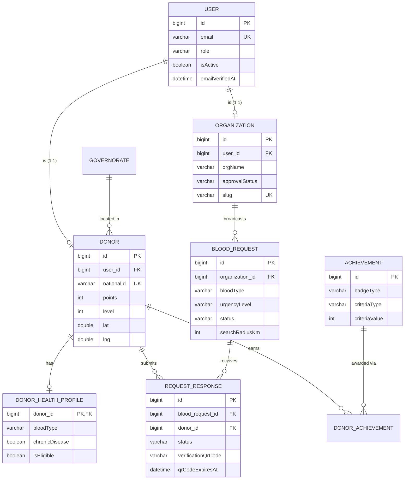
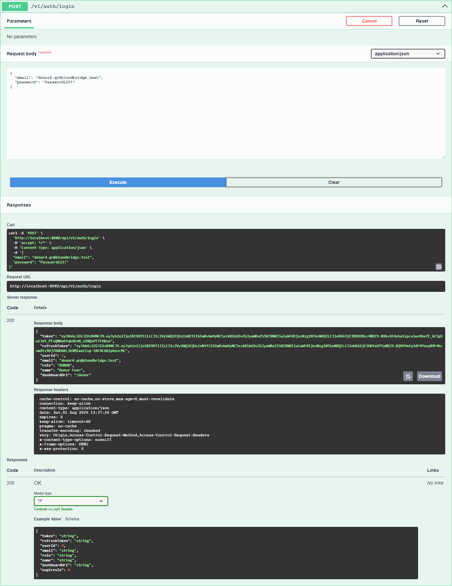
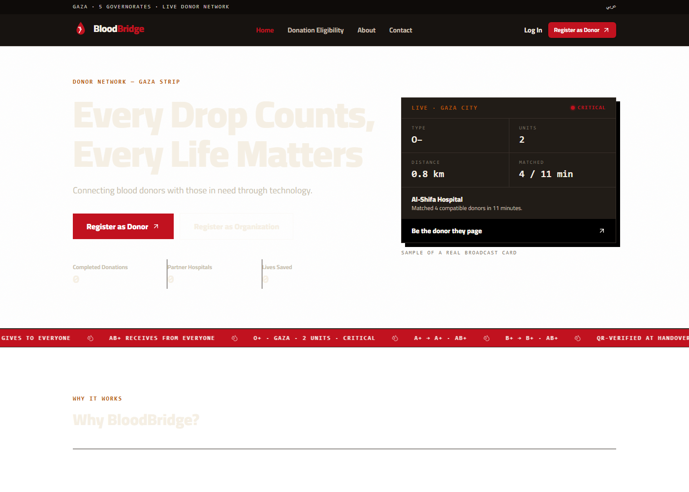
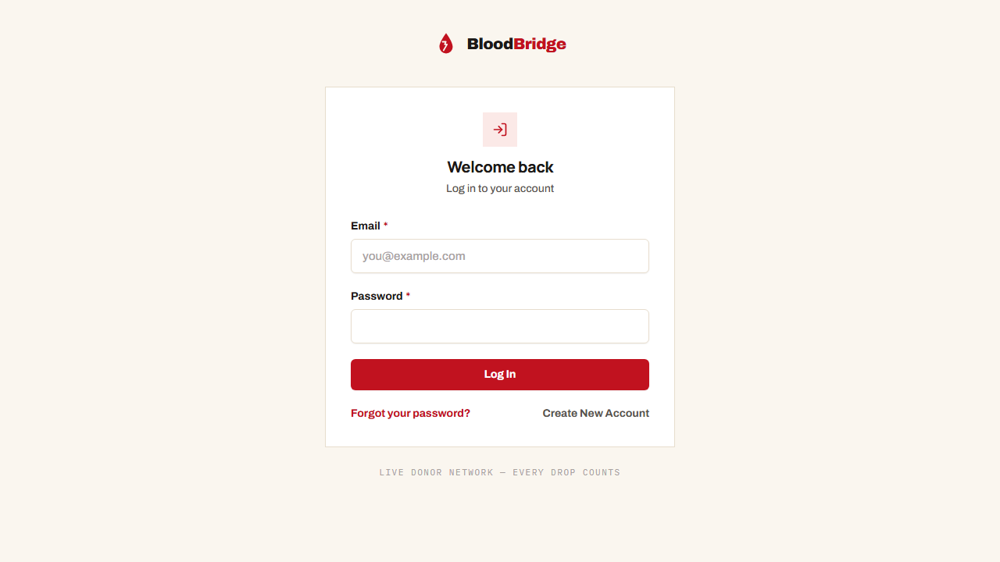

<div align="center">


<br/>

**Every drop has a destination.**
A production-oriented REST API that matches blood donation requests to eligible donors in real time — progressive-radius broadcast, QR-verified admission, ML-assisted donor scoring, and full server-side security enforcement.

<br/>


[](#-system-architecture)
[](#-security)
[](#-donor-scoring)

</div>

---

## 📋 Table of Contents

- [Overview](#-overview)
- [System Architecture](#-system-architecture)
- [Blood Request Lifecycle](#-blood-request-lifecycle)
- [Features](#-features)
- [API Reference](#-api-reference)
- [UI Preview](#-ui-preview)
- [Database Schema](#-database-schema)
- [Tech Stack](#-tech-stack)
- [Security](#-security)
- [Known Limitations](#-known-limitations)
- [Getting Started](#-getting-started)
- [Author](#-author)

---

## 🌐 Overview

**BloodBridge** solves a real coordination problem: matching an urgent blood request to donors who are both **nearby** and **actually eligible**, without flooding every donor in the city and without trusting the client to self-report eligibility.

### Design decisions that go beyond a typical CRUD API

| Challenge | How it's solved |
|---|---|
| A fixed search radius either misses donors or spams too many | Progressive radius expansion — starts at a base radius, expands in 5&nbsp;km steps up to 25&nbsp;km until the target donor count is reached (target scales with urgency: normal ×2.0, critical ×2.5, critical starts at 3× the base radius) |
| Donor eligibility can't be trusted client-side | Eligibility (chronic disease, recent surgery, active infection) is enforced **server-side at the interceptor level** — a request never reaches a controller if the donor is ineligible |
| Admission fraud (claiming a donation that didn't happen) | Every accepted response gets a single-use QR token (`SecureRandom`, 7-day expiry, organization-bound); admission is only confirmed by scanning it at the facility |
| ML scoring shouldn't be a single point of failure | Three-tier donor scoring: DB cache → FastAPI ML service (circuit breaker, 3-failure trip, 120s recovery) → rule-based fallback if the ML service is down or disabled |
| New donors have no history to score on | Cold-start scoring (neutral 0.5) with epsilon-greedy exploration (ε=0.20, weekly decay) so new donors still get a fair shot at being matched |
| Cross-organization data leakage | Every organization-scoped read/write validates resource ownership — an org can never read or act on another org's requests, responses, or QR data |
| Reliable event delivery without a message broker | Outbox pattern — domain events are persisted transactionally and re-published by a scheduled poller |

---

## 🏗️ System Architecture



**Notes:**
- All security enforcement — JWT validation, email verification, donor eligibility, and organization approval — happens in the request pipeline **before** any controller logic runs.
- Redis is used for the optional JWT blacklist cache; rate limiting is in-memory (`InMemoryRateLimiter`), not Redis-backed.
- The FastAPI scoring service is an external, optional dependency — the platform functions fully without it via the rule-based fallback.

---

## 🔄 Blood Request Lifecycle



<!-- ===== SCREENSHOT SLOT: QR admission example =====
     Real QR PNG generated by GET /v1/donor/responses/{id}/qr/download
     (ZXing, 32-char SecureRandom token, 7-day expiry). -->
<p align="center">
  
</p>

---

## ✨ Features

### 🔐 Auth & Security
- JWT access + refresh tokens (logout blacklists the access token); BCrypt password hashing
- Full password lifecycle: forgot-password (24h token) → reset-password, authenticated change-password
- Token-based email verification (`verification_token` + expiry, V5 migration) with resend-verification; enforced by interceptor gate
- Role-based access control (`@PreAuthorize`) — Donor / Organization / Admin
- Server-side interceptor gates: email verification, donor eligibility, organization approval
- Ownership validation on all organization-scoped resources (cross-org access → 403)
- Idempotency-key support on mutating endpoints (safe client retries)
- Rate limiting on sensitive endpoints (QR scans, contact form)
- Optimistic locking (`@Version`) on `BloodRequest`, `RequestResponse`, `Donor`; pessimistic locking on donor acceptance to prevent double-accept races

### 🩸 Blood Request Matching
- Create → broadcast → accept/decline/ignore → QR admission → complete lifecycle
- Organization create accepts a validated `BloodRequestCreateRequest` DTO (sane defaults: `NORMAL` urgency, 10 km radius)
- Donor feed supports `bloodType` / `urgency` / `q` filters + pagination; organization listing supports `status` filter + pagination
- Progressive radius expansion with urgency-scaled donor targets
- Unknown-blood-type fallback pool for non-critical requests
- Governorate-based fallback matching when coordinates are unavailable

### 🤖 Donor Scoring
- Optional FastAPI ML integration with a custom circuit breaker
- Rule-based fallback scorer (fully functional with ML disabled)
- Epsilon-greedy exploration so new/low-history donors still get matched

### 🏅 Gamification
- Points and levels awarded on donation completion
- Achievement/badge system (e.g. "First Donation") with criteria-based unlocking

### 🏢 Organization & Admin
- Organization profile, request management, response tracking with aggregate counts
- Admin console: organization approval workflow, platform-wide oversight, announcements, contact messages, settings
- Public metadata for clients: governorates, platform stats, public settings

### 🔔 Notifications
- Database-persisted, locale-aware notifications (match pages, responses, announcements)
- REST API: paginated list with `unreadOnly` filter, unread-count badge, mark-read / mark-all-read (ownership-enforced)

### 📊 Observability
- Micrometer metrics exported to Prometheus, Grafana dashboards
- Structured audit logging on critical operations (logback file appender → `logs/bloodbridge.log`)
- springdoc OpenAPI / Swagger UI

---

## 📡 API Reference

55 endpoints across 6 controllers (+1 dev-only probe under the `h2` profile), all under the `/api` context-path · Full interactive docs at `/swagger-ui/index.html`

<!-- ===== SCREENSHOT: full endpoint list, Swagger UI =====
     Captured from the running API (h2 profile) via headless Chrome.
     Regenerate: chrome --headless --window-size=1400,5600 --screenshot=docs/screenshots/swagger-endpoints.png http://localhost:8080/api/swagger-ui/index.html -->
<p align="center">
  
</p>

| Method | Endpoint | Role | Description |
|---|---|---|---|
| `POST` | `/api/v1/auth/register` | Public | Register donor/organization (admin self-registration rejected) |
| `POST` | `/api/v1/auth/login` | Public | Login → access + refresh token |
| `POST` | `/api/v1/auth/refresh` | Public | Rotate access token |
| `POST` | `/api/v1/auth/logout` | Authenticated | Blacklist current access token |
| `GET` | `/api/v1/auth/profile` | Authenticated | Current user profile + verification flags |
| `POST` | `/api/v1/auth/forgot-password` | Public | Mint password-reset token (24h expiry) |
| `POST` | `/api/v1/auth/reset-password` | Public | Consume reset token → set new password |
| `POST` | `/api/v1/auth/change-password` | Authenticated | Change password (current password required) |
| `POST` | `/api/v1/auth/verify-email` | Public | Consume email-verification token (V5 migration) |
| `POST` | `/api/v1/auth/resend-verification` | Public | Re-issue a verification token |
| `GET` | `/api/v1/notifications` | Authenticated | Paginated notifications (`unreadOnly` filter) |
| `GET` | `/api/v1/notifications/unread-count` | Authenticated | Unread badge count |
| `POST` | `/api/v1/notifications/{id}/read` | Authenticated | Mark one notification read (ownership-enforced) |
| `POST` | `/api/v1/notifications/read-all` | Authenticated | Mark all notifications read |
| `GET` | `/api/v1/public/governorates` | Public | Active governorates (ordered) |
| `GET` | `/api/v1/public/stats` | Public | Platform counters (donors, orgs, lives saved, active requests) |
| `GET` | `/api/v1/public/settings` | Public | Public site settings (name, slogan, support contacts) |
| `GET` | `/api/v1/donor/profile` | Donor | Donor profile + health data |
| `GET` | `/api/v1/donor/blood-requests` | Donor | Geo-matched active request feed |
| `POST` | `/api/v1/donor/blood-requests/{id}/accept` | Donor | Accept request → QR token issued |
| `GET` | `/api/v1/donor/achievements` | Donor | Earned/locked achievements, points, level |
| `POST` | `/api/v1/org/blood-requests` | Organization | Create + broadcast a blood request |
| `GET` | `/api/v1/org/blood-requests/{id}` | Organization | Request detail (ownership-enforced) |
| `POST` | `/api/v1/org/scan-qr` | Organization | Confirm admission (rate-limited 30/min) |
| `POST` | `/api/v1/org/responses/{id}/complete` | Organization | Complete a donation |
| `PUT` | `/api/v1/admin/organizations/{id}/approve` | Admin | Approve a pending organization |

<details>
<summary><b>📂 See all 55 endpoints (grouped by controller)</b></summary>

**AuthController** — register, login, refresh, logout, profile, forgot/reset/change password, verify-email, resend-verification (10)
**DonorController** — profile, health profile update, request feed (filterable: `bloodType`, `urgency`, `q`; pageable), accept/decline/ignore, QR download, achievements, eligibility status, donation history (10)
**OrganizationController** — profile, request CRUD/re-broadcast (DTO-validated create, filterable + pageable listing), response listing with aggregates, QR scan, complete (10)
**AdminController** — paginated users/donors/organizations/blood-requests/responses, organization approve/reject, achievements CRUD, contact messages, announcements, platform settings (17)
**PublicController** — contact form submission, governorates, platform stats, public settings (4)
**NotificationController** — paginated list, unread count, mark read / mark all read (4)
**DevVerifyProbe** (`h2` profile only) — dev-only email-verification probe (1)

</details>

<!-- ===== SCREENSHOT SLOT: real request/response samples =====
     Two high-value samples, matching the reference format:
       1. POST /api/v1/org/blood-requests — request body + 201 response (BROADCASTED)
       2. POST /api/v1/donor/blood-requests/{id}/accept — response showing the QR token/URL
     Capture from Swagger UI or Postman, upload, and replace the srcs below. -->
<details>
<summary><b>📸 Sample: create a blood request</b></summary>

```jsonc
// POST /api/v1/org/blood-requests
// Authorization: Bearer <org-token>

{
  "bloodType": "A_POSITIVE",
  "unitsNeeded": 2,
  "urgencyLevel": "CRITICAL",
  "searchRadiusKm": 10,
  "lat": 31.5017,
  "lng": 34.4668,
  "locationAddress": "Al-Shifa Hospital, Gaza City",
  "additionalNotes": "Critical need for pediatric ward"
}
```

```json
// 201 Created — BROADCASTED
{
  "id": 1,
  "bloodType": "A_POSITIVE",
  "unitsNeeded": 2,
  "urgencyLevel": "CRITICAL",
  "status": "BROADCASTED",
  "searchRadiusKm": 10,
  "additionalNotes": "Critical need for pediatric ward"
}
```

</details>

<details>
<summary><b>📸 Sample: donor accepts → QR token issued</b></summary>

```jsonc
// POST /api/v1/donor/blood-requests/1/accept?lat=31.5017&lng=34.4668
// Authorization: Bearer <donor-token>
```

```json
// 201 Created
{
  "id": 1,
  "status": "ACCEPTED",
  "verificationQrCode": "a4fdacff...213859",
  "qrCodeExpiresAt": "2026-08-08T12:00:00",
  "distanceKm": 1.2
}
```

</details>

---

## 🗄️ Database Schema

17 domain entities + 3 infrastructure entities · 5 Flyway migrations (V1 base schema, V2 seed data, V3 infrastructure tables, V4 enum-storage migration, V5 email-verification token columns on `users`):



<!-- Optional: a real ERD (MySQL Workbench / DBeaver / JetBrains) can be added here
     beside the mermaid diagram to prove the schema is real. -->


---

## 🛠️ Tech Stack

| Layer | Technology | Notes |
|---|---|---|
| Language | Java 21 | Core language |
| Framework | Spring Boot 3.3.2 | Application framework |
| Security | Spring Security + jjwt 0.12.6 | Stateless JWT auth |
| Persistence | Spring Data JPA / Hibernate | `ddl-auto: validate`, Flyway-managed schema |
| Database | MySQL 8 (prod) / H2 (dev `h2` profile) | Flyway V1–V4 |
| Cache | Redis | Optional JWT blacklist cache |
| ML Integration | WebClient → FastAPI (external, optional) | Custom circuit breaker, 8s timeout |
| QR Codes | ZXing 3.5.2 | Admission verification |
| Docs | springdoc OpenAPI 2.6.0 | Swagger UI |
| Observability | Micrometer + Prometheus + Grafana | Docker Compose services |
| Testing | JUnit 5, Testcontainers (MySQL), H2 | 169 tests |
| Build | Maven | Dependency management |

**Declared but not currently wired** (present in `pom.xml`, not active in the code path): Resilience4j (a custom circuit breaker is used instead), Quartz (`@Scheduled` is used instead), WebSocket, Spring Mail, Freemarker, MapStruct.

---

## 🔒 Security

Enforced across three layers — Spring Security, interceptors, and service-level ownership checks:

- **Stateless JWT** — access + refresh tokens, role-based `@PreAuthorize`
- **Interceptor chain (active, verified)** — email verification gate, donor eligibility gate, organization approval gate, all enforced before controller logic runs
- **Ownership checks** — organization-scoped reads/writes verify the authenticated organization owns the resource; cross-organization access returns 403
- **QR admission security** — `SecureRandom`-generated tokens, 7-day expiry, organization-bound validation
- **Idempotency-key replay protection** on mutating endpoints
- **Rate limiting** on QR scans and public contact submissions
- **Optimistic + pessimistic locking** to prevent race conditions on concurrent donation acceptance

<!-- Real Swagger UI try-it-out execution of POST /v1/auth/login (200 with token pair) -->
<p align="center">
  
</p>

<details>
<summary><b>📸 Sample: login → refresh token rotation</b></summary>

```jsonc
// POST /api/v1/auth/login
{
  "email": "donor@example.com",
  "password": "********"
}
```

```json
// 200 OK
{
  "token": "eyJhbGciOi...",
  "refreshToken": "eyJhbGciOi...",
  "expiresIn": 86400000
}
```

</details>

### Known Limitations

| Limitation | Detail |
|---|---|
| Production email sending | Token-based email verification is fully implemented (register mints a 24h token, `POST /v1/auth/verify-email` consumes it, the interceptor enforces it), but no production **mail-sending** integration exists yet — verification emails and password-reset emails are not actually delivered. Under the `h2` profile the API returns the tokens as `devResetToken` / `devVerificationToken` so the full flow is testable locally; a real mail provider is required before production rollout. The dev-only `POST /v1/public/verify-dev` probe also remains, strictly under the `h2` profile. |
| Organization approval bypass | The full approval workflow (PENDING/APPROVED/REJECTED, admin approve/reject endpoints, enforcement interceptor) is implemented, but `register()` auto-approves new organizations only when `bloodbridge.org.auto-approve` is true (default; set `ORG_AUTO_APPROVE=false` to enforce the real admin approval queue) — an intentional demo simplification so organizations are usable immediately. Re-enabling real approvals is a separate design decision. |
| ML scoring service | Disabled by default (`ml-enabled: false`); the FastAPI companion service lives outside this repository. The platform runs fully on the rule-based fallback scorer without it. |
| Rate limiting scope | In-memory, single-instance — not distributed across multiple app instances. |
| Notification delivery | Notifications are persisted to the database only; no email/SMS/push delivery is wired yet. |

---

## 🖥️ UI Preview

The companion React frontend (Vite + Tailwind) consumes the public, auth, and notification endpoints above — live stat counters on the home page are served by `GET /api/v1/public/stats`, and the login form links directly into the forgot/reset-password flow.

<p align="center">
  
</p>
<p align="center">
  
</p>

---

## 🚀 Getting Started

### Prerequisites
- JDK 21, Maven 3.9+
- Node.js 20+ (frontend)
- Docker (optional, for MySQL/Redis/Prometheus/Grafana via Compose)

### Backend — quick start (H2, no database required)

```bash
mvn package -DskipTests
java -jar target/bloodbridge-1.0.0-SNAPSHOT.jar
```

`h2` is the default Spring profile, so no database setup is needed (explicit `--spring.profiles.active=h2` also works).
Starts on `http://localhost:8080/api`, seeded with sample data via `data.sql`.

### Backend — MySQL

```bash
# set DB_HOST, DB_PORT, DB_DATABASE, DB_USERNAME, DB_PASSWORD env vars
mvn package
java -jar target/bloodbridge-1.0.0-SNAPSHOT.jar
```

### Frontend

```bash
cd bloodbridge-frontend
npm install
npm run dev   # http://localhost:3000, proxies /api to the backend
```

### Docker Compose

```bash
docker compose up -d mysql redis prometheus grafana app
```
> Note: the compose file also declares an `ai-service` whose build context points to a companion repo not included here — omit that service or provide it separately.

---

## 👤 Author

<table>
  <tr>
    <td align="center" width="300">
      <b>Mahmoud Youssef</b><br/>
      <sub>Backend Engineer</sub><br/><br/>
      <a href="https://github.com/MahmoudYoussef-web">
        
      </a>
      <br/>
      <a href="https://www.linkedin.com/in/mahmoud-youssef-ba30723bb">
        
      </a>
    </td>
  </tr>
</table>

---

<div align="center">
  <sub>Built phase by phase — Core Domain → Broadcast & Matching → QR Admission → Donor Scoring → Gamification → Security Hardening.</sub>
</div>
